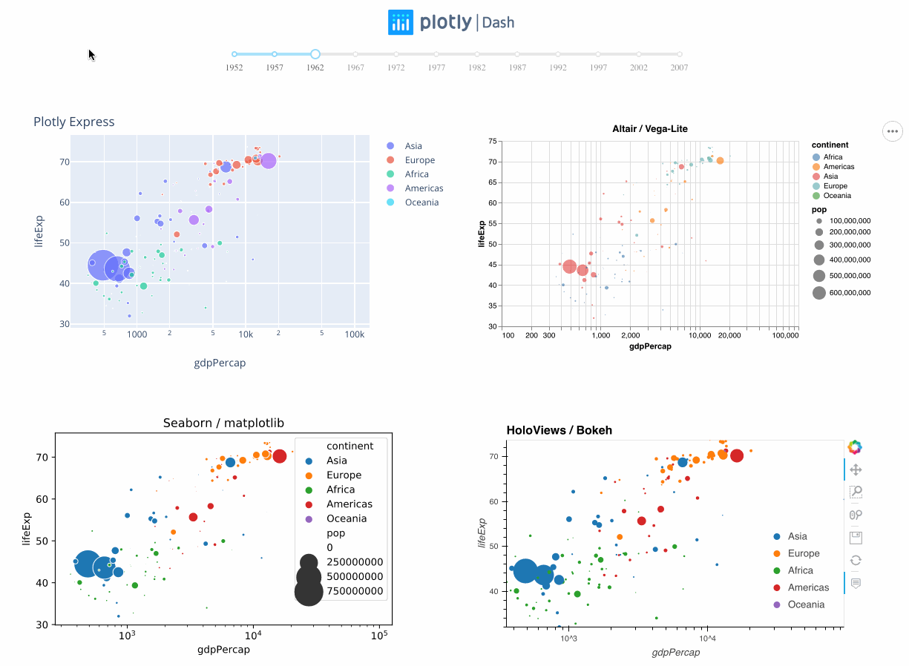

# dash-alternative-viz

In `dash-core-components`, the `dcc.Graph` component uses standard [Plotly](https://plot.ly/python) figures.

Dash’s [component plugin system](https://dash.plot.ly/plugins) provides a
toolchain to create Dash components from any JavaScript-based library.
`dash-alternative-viz` is a proof-of-concept Dash component library that provides Dash
interfaces to Altair, matplotlib (or any compatible system like Seaborn, Pandas.plot, Plotnine and others!), and Bokeh (with or without HoloViews).
Note that the Plotly graphing interface is available in the `dash_core_components`
library as `dcc.Graph`.

### [`usage.py`](https://github.com/plotly/dash-alternative-viz/blob/master/usage.py) demo

### Looking for something more generic?

- For general images (SVG, PNG, JPG, GIF), see the `html.Img` component.
- For XSS-safe Python interfaces for HTML, see `dash_html_components`
- For raw HTML or SVG strings, see `dash_dangerously_set_inner_html`
- For interactive data tables, see `dash_table`
- For interactive network graphs, see `dash_cytoscape`
- For interactive controls & plotly graphs, see `dash_core_components`
- For bioinformatics components, see `dash_bio`
- For technical components for data acq and engineering hardware, see `dash_daq`
- For interactive image editing, see `dash_canvas`

### Having trouble choosing which graphing library to use?

Of course, we’re biased but we think that the Plotly library has you covered
on most bases. It’s in active development, here are some new features ICYMI:
- Easy grammar-of-graphics-inspired Pandas plotting in [Plotly Express](https://medium.com/@plotlygraphs/introducing-plotly-express-808df010143d)
- Fast static image export with [`plotly.io`](https://medium.com/@plotlygraphs/plotly-py-end-of-summer-updates-5422c98b9058)
- Jupyter Widget support with [`FigureWidget`](https://medium.com/@plotlygraphs/introducing-plotly-py-3-0-0-7bb1333f69c6)
- [JupyterLab support](https://github.com/plotly/jupyterlab-dash)
- [Datashader support](https://github.com/plotly/dash-datashader)
